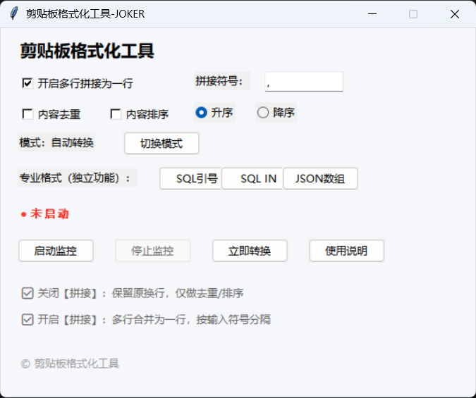
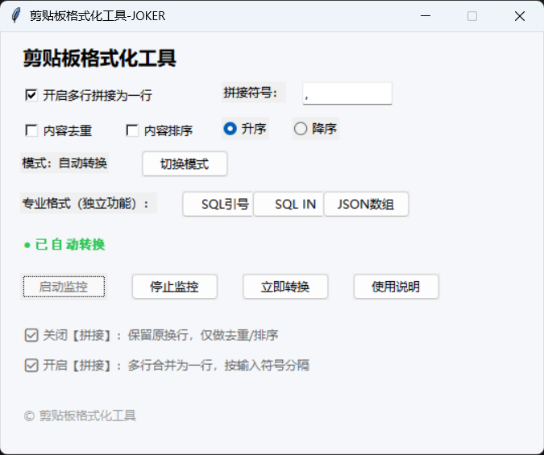

# 📋 ClipboardMaster

> 轻量、强大的 Windows 剪贴板增强工具 —— 让每一次复制粘贴都高效有序。

ClipboardMaster 是一款专为 Windows 设计的剪贴板格式化工具。支持自定义剪切板内容处理，支持专业格式、支持自动、手动模式切换，直接粘贴目标形式内容，Coder和日常办公友好，告别手动复杂处理。

## 📸 截图预览

| 主窗口 | 运行中 |
|:---:|:---:|
|  |  |

## ⬇️ 下载与安装

1. 前往 [Joker](https://github.com/WeiSurong/ClipboardMaster) 下载最新版本的压缩包 `ClipboardMaster.zip`。
2. 解压得到 `ClipboardMaster.exe` 双击运行即可，**无需安装**（绿色便携版）。
3. （可选）将 exe 放入任意文件夹，右键发送到桌面快捷方式，方便启动。
4. 放心使用，安全、无毒、无公害。

> 💡 **系统要求**：Windows 10 / Windows 11（64位），没有 mac 所以暂时不支持 mac。

## 🚀 核心功能

- 📜 **多行拼接成一行**：支持自定义拼接符号，实现多行转一行。
- 🖼️ **内容去重**：支持自动去重。
- ⚡ **内容排序**：支持内容排序，升序、降序自选。
- 🗂️ **模式切换**：支持自动转换及手动转换，应对批量及临时操作。
- 🧹 **专业格式**：支持 `SQL 引号`、`SQL IN`、`JSON 数组` 转换，Coder 友好。
- 🎨 **系统友好**：占用资源小。

## 📝 使用指南

### 基本操作

启动后，根据需求组合使用需要的功能，启动监控后 `CTRL+C` 复制内容，`CTRL+V` 粘贴内容。

## 📄 版本历史

### v1.0.0 (2026-06-08)
- 🎉 首次稳定发布
- 支持文本格式内容快速处理
- 支持UI界面操作
- 支持windows

## 📃 开源许可证

本项目开源，你可以免费使用、修改和分发，但需保留版权声明。

## 🙏 致谢

- 图标来自 [Feather Icons](https://feathericons.com/)
- 受 [Ditto](https://ditto-cp.sourceforge.io/) 启发

---

**如果你喜欢这个工具，请给一个 ⭐Star 支持一下！**
